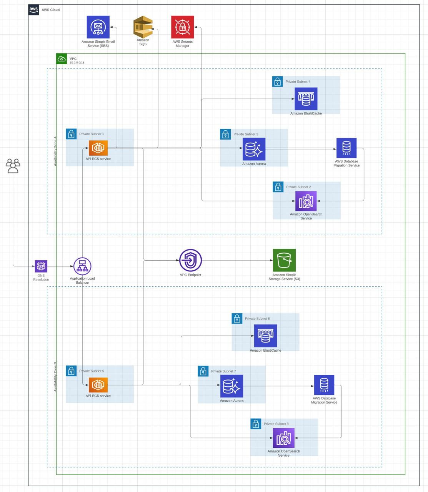

# Project Tasks Overview

This README provides an overview of the tasks completed within the current project, along with brief descriptions for each task code.

## Task List

### C1 (MVC)
- The task involved the implementation or refinement of the Model-View-Controller (MVC) architectural pattern, segregating the application into distinct components for data, user interface, and user interactions.
- Entities:
  - [User](src/main/java/com/konstde00/todo_app/domain/User.java)
  - [Authority](src/main/java/com/konstde00/todo_app/domain/Authority.java)
  - [Task](src/main/java/com/konstde00/todo_app/domain/Task.java)
  - [File](src/main/java/com/konstde00/todo_app/domain/File.java)

### C2 (Cloud)
- Deployed the application to AWS cloud platform.
- AWS services used:
  - Amazon Elastic Container Registry (ECR)
  - Amazon Elastic Container Service (ECS)
  - Amazon Relational Database Service (RDS)
  - Amazon Simple Storage Service (S3)
  - Amazon Simple Queue Service (SQS)
  - Amazon ElastiCache
  - Amazon SecretsManager
  - Amazon CloudWatch
  - Amazon Route 53
  - Amazon Certificate Manager (ACM)
  - Amazon Virtual Private Cloud (VPC)
  - Amazon Elastic Load Balancing (ELB)
  - Amazon Identity and Access Management (IAM)
- Diagram of the cloud architecture is available [here](https://lucid.app/lucidchart/c3ecb718-9d48-46b7-b372-a2fc661790a3/edit?viewport_loc=-666%2C225%2C4669%2C2683%2C0_0&invitationId=inv_552b9e78-90b1-4cd1-9962-25ddcb94b8b8)

- Management of cloud resources was done using Terraform. 
  - Configuration files are available [here](terraform)
  - For storing state and performing operations for configuration management Terraform Enhanced backend (Terraform Cloud) was used.

### C3 (CI/CD)
- Created a CI/CD workflows using CircleCI. 
- CircleCI configuration file is available [here](.circleci/config.yml)

### C4 (Containerisation)
- Containerised the application using Docker and JIB Gradle plugin, allowing for easy deployment and scaling of the application.
- Gradle function for building a Docker image is available [here](gradle/docker.gradle)
- Command to build a Docker image
  - locally: `./gradlew jibDockerBuild`
  - remotely: `gradle jib`
- After build, image is automatically pushed to ECR repository: `553440882962.dkr.ecr.us-east-1.amazonaws.com/todo_app_be`

### C5 (REST-api)
- Implementation of a REST API, allowing for communication between the application and external systems.
- API-first approach was used for designing the API, controllers and DTOs were generated using [OpenApi generator](https://openapi-generator.tech/) based on [api.yaml](swagger/api.yml).

### C12 (2do-list)
- Implementation of a to-do list feature within the application, enabling users to manage tasks or activities.

### C16 (OAuth2)
- Implementation of OAuth 2.0 (with Google IDP) for user authentication and authorization, allowing secure access to resources without direct password sharing.

### C19 (Static content)
- Used AWS S3 to manage user profile pictures
- API endpoint for uploading a profile picture: 
`PATCH /api/users/v1/profile/picture`

### B1 (Pagination API)
- Implemented a pagination API. 
- Example of API endpoints where pagination is enabled:
  - `GET /api/tasks/v1`
  - `GET /api/admin/v1/users`

### B6 (Feature flags)
- Implementation of feature flags, allowing for the dynamic enabling or disabling of application features.
- Currently, feature flags are used for enabling/disabling the analytics list feature 

### B7 (Serverless)
- AWS Fargate is used for running the application in a serverless manner.
- Terraform module: [api-fargate-service](terraform/api-fargate-service)
- Service configuration: [todo_app_api_service](terraform/main.tf?plain=1)

### B8 (Asynchronous process)
- In this project it is used for asynchronous processing of password-reset requests, in [PasswordResetProducer](com/konstde00/todo_app/service/password_reset/PasswordResetProducer.java) 
    and [PasswordResetConsumer](com/konstde00/todo_app/service/password_reset/PasswordResetConsumer.java)
- Technologies used:
  - Amazon Simple Queue Service (SQS)
  - `io.awspring.cloud.sqs` library

### B9 (API caching)
- Technologies used:
  - ElastiCache (with Redis engine)
  - `org.springframework.cache` module
- Example of API endpoints where caching is enabled:
  - `GET /api/tasks/{taskId}`
  - `GET /api/users/{userId}`
